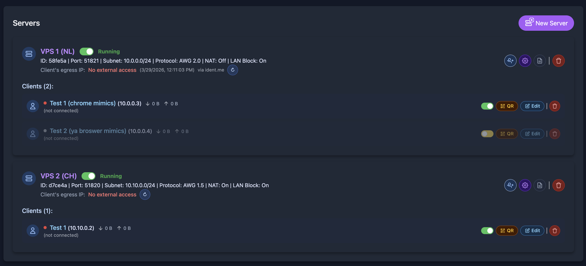

# AmneziaWG Web UI

A comprehensive web-based management interface for AmneziaWG VPN servers. This service provides an easy-to-use web UI to create, manage, and monitor WireGuard VPN servers with AmneziaWG's advanced obfuscation features.
All server configuration is done via web interface or via API endpoints. Providing env variables at docker startup is supported but doesn't make much sense: all settings can be overridden via web interface except for NGINX_PORT.



## 🚀 Features

*   **Web-based Management**: Intuitive UI for managing VPN servers and clients
*   **AmneziaWG Integration**: Full support for AmneziaWG's obfuscation features
*   **Multiple Protocols**: Support for WireGuard with traffic obfuscation
*   **Client Management**: Generate and download client configurations
*   **Real-time Monitoring**: Live server status and connection monitoring
*   **Auto-start**: Automatic server startup on container restart
*   **IPTables Automation**: Automatic firewall configuration
*   **Custom MTU**: Configurable MTU settings (1280-1440)

## 🏗️ Architecture

### Components

**Flask Backend** (`app.py`)

*   RESTful API for server management
*   WebSocket support for real-time updates
*   AmneziaWG configuration generation
*   Client config management

**Vue.js Frontend** (`static/js/app.js`)

*   Responsive web interface
*   Real-time status updates
*   Form validation and error handling

**Nginx** (`config/nginx.conf`)

*   Reverse proxy for Flask application
*   Static file serving
*   WebSocket proxy support

**Supervisor** (`config/supervisord.conf`)

*   Process management
*   Automatic service restart
*   Log management

### Directory Structure

```
/app/web-ui/
├── app.py # Flask application
├── templates/
│ └── index.html # Main web interface
└── static/
├── js/
│ └── app.js # Frontend JavaScript
└── css/
└── style.css # Custom styles
```

## 🔧 API Endpoints

### Server Management

#### Create Server

```yaml
POST /api/servers
Content-Type: application/json

{
  "name": "My VPN Server",
  "port": 51820,
  "subnet": "10.0.0.0/24",
  "mtu": 1280,
  "obfuscation": true,
  "auto_start": true,
  "obfuscation_params": {
    "Jc": 8,
    "Jmin": 8,
    "Jmax": 80,
    "S1": 50,
    "S2": 60,
    "H1": 1000,
    "H2": 2000,
    "H3": 3000,
    "H4": 4000,
    "MTU": 1280
  }
}
```

#### List Servers

`GET /api/servers`

#### Start Server

`POST /api/servers/{server_id}/start`

#### Stop Server

`POST /api/servers/{server_id}/stop`

#### Delete Server

`DELETE /api/servers/{server_id}`

#### Get Server Configuration

`GET /api/servers/{server_id}/config`

#### Download Server Config

`GET /api/servers/{server_id}/config/download`

#### Get Server Info

`GET /api/servers/{server_id}/info`

### Client Management

#### Add Client

```yaml
POST /api/servers/{server_id}/clients
Content-Type: application/json
{
"name": "Alice's Phone"
}
```

#### List Server Clients

`GET /api/servers/{server_id}/clients`

#### Delete Client

`DELETE /api/servers/{server_id}/clients/{client_id}`

#### Download Client Config

`GET /api/servers/{server_id}/clients/{client_id}/config`

#### List All Clients

`GET /api/clients`

### System Management

#### System Status

`GET /api/system/status`

#### Refresh Public IP

`GET /api/system/refresh-ip`

#### IPTables Test

`GET /api/system/iptables-test?server_id=wg_abc123`

### Export Configuration

`GET /api/config/export`

## 🐳 Docker Deployment

Official docker image repository: https://hub.docker.com/r/alexishw/amneziawg-web-ui

### Environment Variables

| Variable | Default | Description |
|----------|---------|-------------|
| `NGINX_PORT` | `80` | External port for web interface |
| `AUTO_START_SERVERS` | `true` | Auto-start servers on container startup |
| `DEFAULT_MTU` | `1280` | Default MTU value for new servers. Effective only for api requests. For UI management set via UI. |
| `DEFAULT_SUBNET` | `10.0.0.0/24` | Default subnet for new servers. Effective only for api requests. For UI management set via UI. |
| `DEFAULT_PORT` | `51820` | Default port for new servers. Effective only for api requests. For UI management set via UI. |
| `DEFAULT_DNS` | `8.8.8.8,1.1.1.1` | Default DNS servers for clients. Effective only for api requests. For UI management set via UI. |

### Docker Compose Example

```yaml
version: '3.8'
services:
  amnezia-web-ui:
    image: alexishw/amneziawg-web-ui:master
    build: .
    container_name: amnezia-web-ui
    ports:
      - "80:80/tcp"
      - "51820:51820/udp"
    environment:
      - NGINX_PORT=8080
      - AUTO_START_SERVERS=true
      - DEFAULT_MTU=1280
    volumes:
      - amnezia-data:/etc/amnezia
    cap_add:
      - NET_ADMIN
      - SYS_MODULE
    devices:
      - /dev/net/tun
    sysctls:
      - net.ipv4.ip_forward=1
      - net.ipv4.conf.all.src_valid_mark=1
      - net.ipv6.conf.all.disable_ipv6=0
      - net.ipv6.conf.all.forwarding=1
      - net.ipv6.conf.default.forwarding=1
    restart: unless-stopped
volumes:
 amnezia-data:
```

### Docker Run Example

```bash
docker run -d \
  --name amnezia-web-ui \
  --cap-add=NET_ADMIN \
  --cap-add SYS_MODULE \
  --sysctl net.ipv4.ip_forward=1 \
  --sysctl net.ipv4.conf.all.src_valid_mark=1 \
  --sysctl net.ipv6.conf.all.disable_ipv6=0 \
  --sysctl net.ipv6.conf.all.forwarding=1 \
  --sysctl net.ipv6.conf.default.forwarding=1 \
  --device /dev/net/tun \
  --restart unless-stopped \
  -p 9090:9090 \
  -p 51821:51821/udp \
  -e NGINX_PORT=9090 \
  -e AUTO_START_SERVERS=false \
  -e DEFAULT_MTU=1420 \
  -e DEFAULT_SUBNET=10.8.0.0/24 \
  -e DEFAULT_PORT=51821 \
  -e DEFAULT_DNS="8.8.8.8,8.8.4.4" \
  -v amnezia-data:/etc/amnezia \
  alexishw/amneziawg-web-ui:master
```

## 📊 Obfuscation Parameters

AmneziaWG supports advanced traffic obfuscation to bypass censorship and DPI (Deep Packet Inspection).

## Parameter Reference

| Parameter | Range | Default | Recommended | Description |
| --- | --- | --- | --- | --- |
| `Jc` | 1-128 | 8 | 4-12 | Controls connection pattern frequency |
| `Jmin` | 1-1279 | 8 | 8 | Minimum padding size for packets |
| `Jmax` | Jmin+1 to 1280 | 80 | 80 | Maximum padding size for packets |
| `S1` | 1-1132 | 50 | 15-150 | Obfuscation pattern parameter 1 |
| `S2` | 1-1188 | 60 | 15-150 | Obfuscation pattern parameter 2 |
| `H1` | 5-2147483647 | 1000 | Unique | Header obfuscation parameter 1 |
| `H2` | 5-2147483647 | 2000 | Unique | Header obfuscation parameter 2 |
| `H3` | 5-2147483647 | 3000 | Unique | Header obfuscation parameter 3 |
| `H4` | 5-2147483647 | 4000 | Unique | Header obfuscation parameter 4 |
| `MTU` | 1280-1440 | 1280 | 1280-1420 | Maximum Transmission Unit |

## Detailed Parameter Explanation

### Jc (Connection Parameter)

*   **Purpose**: Controls how frequently connection patterns are applied
*   **Lower values**: More frequent pattern application (more obfuscation, lower performance)
*   **Higher values**: Less frequent pattern application (less obfuscation, better performance)
*   **Recommended**: 4-12 for optimal balance

### Jmin and Jmax (Padding Parameters)

*   **Jmin**: Minimum random padding added to each packet
*   **Jmax**: Maximum random padding added to each packet
*   **Relationship**: Jmax must be greater than Jmin
*   **Note**: Values are constrained by MTU (typically 1280 for basic internet)

### S1 and S2 (Pattern Parameters)

*   **Purpose**: Define obfuscation patterns for traffic shaping
*   **Constraints**:
    *   S1 ≤ 1132 (1280 - 148 = 1132)
    *   S2 ≤ 1188 (1280 - 92 = 1188)
    *   S1 + 56 ≠ S2 (must be different with margin)
*   **Recommended**: 15-150 for effective obfuscation

### H1-H4 (Header Parameters)

*   **Purpose**: Unique identifiers for header obfuscation
*   **Requirement**: All four values must be unique
*   **Recommended**: Use random values in range 1000-1000000

### MTU (Maximum Transmission Unit)

*   **Purpose**: Defines maximum packet size
*   **Standard Internet**: 1280 (safe for all connections)
*   **Better Performance**: 1420-1440 (may have compatibility issues)
*   **Trade-off**: Higher MTU = better performance but potential fragmentation

## 📝 Logs and Monitoring

### Application logs

`docker exec amnezia-web-ui tail -f /var/log/web-ui/access.log`

`docker exec amnezia-web-ui tail -f /var/log/web-ui/error.log`

### Nginx logs

`docker exec amnezia-web-ui tail -f /var/log/nginx/access.log`

`docker exec amnezia-web-ui tail -f /var/log/nginx/error.log`

### Supervisor logs

`docker exec amnezia-web-ui tail -f /var/log/supervisor/supervisord.log`

## 🔄 Backup and Restore
Export Configuration

### Export all configuration via API

`curl http://localhost/api/config/export > amnezia_backup.json`

### Backup configuration directory

`docker cp amnea-web-ui:/etc/amnezia ./amnezia-backup/`

## Debug Commands

### Check serv status

`curl http://localhost/api/system/status`

### Test iptables configuration

`curl "http://localhost/api/system/iptables-test?server_id=wg_abc123"`

# Security
The app is exposed directly without authentication.

> [!IMPORTANT]
> I strongly recommend protecting endpoints with firewall and/or nginx authentication.

# Support
The NO support provided as well as no regualr upodates are planned. Found issues can be fixed if free time permits.

From Russia with L❤️VE