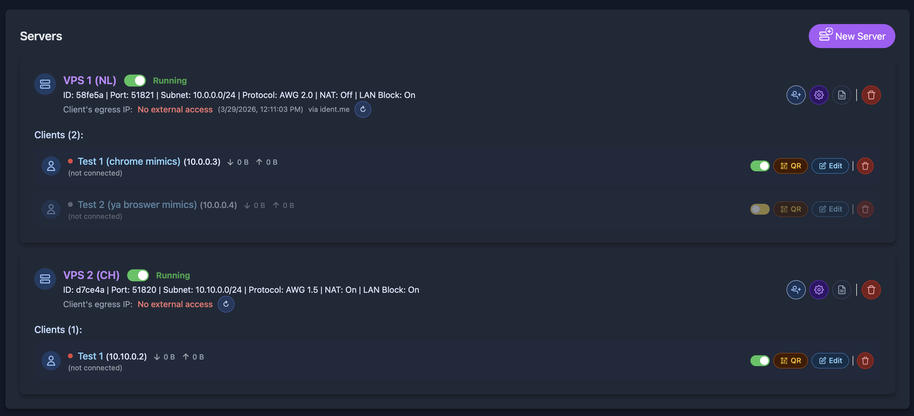

# AmneziaWG Web UI

A comprehensive web-based management interface for AmneziaWG VPN servers. This service provides an easy-to-use web UI to create, manage, and monitor WireGuard VPN servers with AmneziaWG's advanced obfuscation features.
Most server configuration is done via the web interface or API endpoints. However, some defaults are controlled only via environment variables at container startup: `NGINX_PORT`, `API_TOKEN`, `ENABLE_GEOIP`,`WAN_IF`, `ALLOWED_ORIGINS`, (NAT/LAN settings `ENABLE_NAT` and `BLOCK_LAN_CIDRS` are defaults per-server and can be overridden in the UI).

Current version: **1.6**



## 🚀 Features

*   **Web-based Management**: Intuitive UI for managing VPN servers and clients
*   **Full AWG 2.0 support**: Clear separation of server transport params (S1–S4, H1–H4) and client-only params (Jc, Jmin, Jmax, I1–I5). Supports H header ranges (`x-y`), S3/S4 padding (AWG 2.0 only; silently ignored for AWG 1.5), and custom signature packets (I1–I5) with full tag syntax.
*   **Client Management**: Generate and download client configurations; click any server or client name to rename it inline
*   **Real-time Monitoring**: Live server status and connection monitoring
*   **Geo for endpoint/server/egress IPs**: Shows client endpoint (`IP:PORT`), server public IP, and egress IP with country flag/location when available
*   **Auto-start**: Automatic server startup on container restart
*   **IPTables Automation**: Automatic firewall configuration
*   **Custom values**: MTU and other connection settings can be customized
*   **QR code**: Client can be viewed, copied and downloaded via text, file or QR code (with size limits)
*   **Config view**: Both servers' and clients' configs can be viewed directly from UI
*   **Client-only params**: Jc, Jmin, Jmax and I1–I5 are stored per-client and written to client configs only (not to the server `.conf`). Each client can override the server defaults.
*   **AWG logs viewer**: Per-server “View Logs” modal with auto-refresh and interface-aware filtering.
*   **Per-server egress IP probe**: Shows each server's final outbound external IP as seen from inside the container, with one-click refresh.
*   **Dark theme**: Full dark mode support with toggle switch.
*   **Client Suspend/Reactivate**: Toggle client access on/off without deleting — keys and settings are preserved.
*   **Smart Defaults**: Auto-proposes next free port and subnet when creating servers; smart IP allocation avoids collisions.
*   **Compact UI**: Server controls as icon buttons, client controls as icon+label pills, toggle switches for server on/off and client suspend.
*   **Refactored codebase**: Backend and frontend split into clearer modules for easier maintenance.

## 📝 Logs (amneziawg-go)

AmneziaWG userspace logs are produced by `amneziawg-go` and are only visible when `LOG_LEVEL` is set. This container exposes a safe wrapper controlled by env vars:

- `AWG_LOG_LEVEL`: `debug|verbose|error|silent` to enable logs (empty/`off` disables).
- `AWG_LOG_FILE`: log file path (default: `/var/log/amnezia/amneziawg-go.log`).

Once enabled, use **Server → View Logs** in the UI. The log view filters by the selected server interface and shows related “startup banner” lines for that interface.

## 🏗️ Architecture

### Components

**Flask Backend**

*   Entry point and app wiring in `web-ui/app.py`
*   Core service logic in `web-ui/services/amnezia_manager.py`
*   API route modules in `web-ui/routes/servers.py` and `web-ui/routes/system.py`
*   Runtime/helpers in `web-ui/core/runtime.py` and `web-ui/core/helpers.py`

**Frontend**

*   Main app logic in `web-ui/static/js/app.js`
*   API utilities in `web-ui/static/js/api.js`
*   Server/client rendering helpers in `web-ui/static/js/server-ui.js`
*   Responsive vanilla-JS UI with real-time status/traffic updates

## 🧩 I1–I5 (Custom Signature Packets)

`I1`–`I5` are custom signature packets sent prior to every handshake. They do not carry actual data, so they only need to be configured on the client side.

- `I1` is the primary packet (if `I1` is empty, the entire I1–I5 chain is skipped).
- `I2`–`I5` are optional follow-up packets (sent in order; empty values are skipped).

Official reference: https://github.com/amnezia-vpn/amneziawg-go#custom-signature-packets

This Web UI treats I1–I5 as **client-only** parameters:

- Server has **default** I1–I5 values (used only when creating *new* clients).
- Each client can override I1–I5 independently (different clients on the same server may have different values).
- Existing clients are **not** modified when server defaults change.
- If an I value is empty, the corresponding `I* = ...` line is **omitted** from generated client configs.

### Tag syntax (quick summary)

I-values are strings composed of tags:

- `<b 0x[hex]>` — static bytes (hex-encoded, e.g. `<b 0xf6ab3267fa>`)
- `<r [size]>` — random bytes (cryptographically secure)
- `<rd [size]>` — random digits (`0-9`)
- `<rc [size]>` — random chars (`a-zA-Z`)
- `<t>` — unix timestamp (4 bytes)

Example: `I1 = <b 0xf6ab3267fa><t><r 10>`

> **Note**: if the final size of any custom signature packet exceeds the system MTU, it may be fragmented, which can look suspicious to DPI.

In the UI:

- **Server → Show Config**: edit I1–I5 defaults for new clients.
- **Client row → I1–I5**: edit I1–I5 for that specific client.

## 📷 QR code notes

WireGuard configs can become too large to fit into a single QR code (especially with long I1–I5 values). When this happens, the UI will show an error in the QR modal and you should use **Download Config File (.conf)** instead.

**Nginx** (`config/nginx.conf`)

*   Reverse proxy for Flask application
*   Static file serving
*   WebSocket proxy support

**Supervisor** (`config/supervisord.conf`)

*   Process management
*   Automatic service restart
*   Log management

### Directory Structure

```
/app/web-ui/
├── app.py # Flask application entrypoint/wiring
├── core/
│ ├── runtime.py # Flask/Socket.IO runtime helpers
│ └── helpers.py # shared utility helpers
├── routes/
│ ├── servers.py # server/client API routes
│ └── system.py # system/status/log routes
├── services/
│ └── amnezia_manager.py # core business logic
├── templates/
│ └── index.html # Main web interface
└── static/
├── js/
│ ├── app.js # Main frontend logic
│ ├── api.js # API/auth/download helpers
│ └── server-ui.js # server/client rendering helpers
└── css/
└── style.css # Custom styles
```

## 🔧 API Endpoints

### Authentication

All `/api/*` endpoints support optional token authentication (configured via `API_TOKEN` env var):

**Using token auth (recommended for scripts/automation):**
```bash
curl -H "Authorization: Bearer YOUR_API_TOKEN" http://localhost:8080/api/servers
```

**Using token auth with Nginx Basic Auth enabled (recommended for this container):**

Nginx Basic Auth uses the `Authorization` header (`Authorization: Basic ...`), so a Bearer token cannot reliably be sent in the same header.
Use `X-API-Token` instead:

```bash
curl -u admin:changeme -H "X-API-Token: YOUR_API_TOKEN" http://localhost:8080/api/servers
```

**Using Nginx Basic Auth (default):**
```bash
curl -u admin:changeme http://localhost:8080/api/servers
```

**CLI tool with token:**
```bash
export AMNEZIA_API_TOKEN=YOUR_API_TOKEN
./scripts/api_status.py --base-url http://localhost:8080 --token $AMNEZIA_API_TOKEN
```

**Generate a token:**
```bash
openssl rand -hex 32
```

### Server Management

#### Create Server

```yaml
POST /api/servers
Content-Type: application/json

{
  "name": "My VPN Server",
  "port": 51820,
  "subnet": "10.0.0.0/24",
  "mtu": 1280,
  "obfuscation": true,
  "auto_start": true,
  "obfuscation_params": {
    "Jc": 8,
    "Jmin": 8,
    "Jmax": 80,
    "S1": 50,
    "S2": 60,
    "S3": null,
    "S4": null,
    "H1": 1000,
    "H2": 2000,
    "H3": 3000,
    "H4": 4000,
    "I1": "",
    "I2": "",
    "I3": "",
    "I4": "",
    "I5": "",
    "MTU": 1280
  }
}
```

Note: `S3`/`S4` are AWG 2.0 parameters. For AWG 1.5 servers they are silently ignored even if provided.

### Obfuscation parameter matching

**Must match** between server and client: `S1`, `S2`, `S3`, `S4`, `H1`–`H4`.

**Client-only** (not written to server config): `Jc`, `Jmin`, `Jmax`, `I1`–`I5`.

#### List Servers

`GET /api/servers`

#### Start Server

`POST /api/servers/{server_id}/start`

#### Stop Server

`POST /api/servers/{server_id}/stop`

#### Delete Server

`DELETE /api/servers/{server_id}`

#### Get Server Configuration

`GET /api/servers/{server_id}/config`

#### Download Server Config

`GET /api/servers/{server_id}/config/download`

#### Get Server Info

`GET /api/servers/{server_id}/info`

#### Update per-server NAT/LAN behavior

`POST /api/servers/{server_id}/networking`

Body example:

```json
{ "enable_nat": true, "block_lan_cidrs": true }
```

#### Update server default I1–I5 (new clients only)

`POST /api/servers/{server_id}/i-params`

Body example:

```json
{ "I1": "...", "I2": "...", "I3": "...", "I4": "...", "I5": "..." }
```

#### Rename Server

`POST /api/servers/{server_id}/rename`

Body: `{ "name": "New Name" }`

### Client Management

#### Add Client

```yaml
POST /api/servers/{server_id}/clients
Content-Type: application/json
{
"name": "Alice's Phone"
}
```

Optional per-client I1–I5 overrides at creation time:

```json
{
  "name": "Alice's Phone",
  "i_params": { "I1": "...", "I2": "...", "I3": "...", "I4": "...", "I5": "..." }
}
```

#### List Server Clients

`GET /api/servers/{server_id}/clients`

#### Delete Client

`DELETE /api/servers/{server_id}/clients/{client_id}`

#### Download Client Config in `text/plain` (.conf file)

`GET /api/servers/{server_id}/clients/{client_id}/config`

#### Download Client Config in JSON format

`GET /api/servers/{server_id}/clients/{client_id}/config-both`

#### Update a specific client's I1–I5

`POST /api/servers/{server_id}/clients/{client_id}/i-params`

#### Rename Client

`POST /api/servers/{server_id}/clients/{client_id}/rename`

Body: `{ "name": "New Name" }`

#### List All Clients

`GET /api/clients`

### System Management

#### System Status

`GET /api/system/status`

#### Refresh Public IP

`GET /api/system/refresh-ip`

#### IPTables Test

`GET /api/system/iptables-test?server_id=wg_abc123`

### Export Configuration

`GET /api/config/export`

## 🐳 Docker Deployment

Official docker image repository: https://hub.docker.com/r/stalker1211/amneziawg15-web-ui

### Environment Variables

| Variable | Default | Description |
|----------|---------|-------------|
| `NGINX_PORT` | `80` | External port for web interface |
| `NGINX_USER` | `admin` | Username for basic auth in the app |
| `NGINX_PASSWORD` | `changeme` | Password for basic auth in the app |
| `AUTO_START_SERVERS` | `true` | Auto-start servers on container startup |
| `DEFAULT_MTU` | `1280` | Default MTU value for new servers. Effective only for api requests. For UI management set via UI. |
| `DEFAULT_SUBNET` | `10.0.0.0/24` | Default subnet for new servers. Effective only for api requests. For UI management set via UI. |
| `DEFAULT_PORT` | `51820` | Default port for new servers. Effective only for api requests. For UI management set via UI. |
| `DEFAULT_DNS` | `8.8.8.8,1.1.1.1` | Default DNS servers for clients. Effective only for api requests. For UI management set via UI. |
| `ENABLE_NAT` | `1` | Default NAT/MASQUERADE setting for new servers (set `0` to disable). Per-server override is available in the UI. |
| `WAN_IF` | *(auto)* | Outbound/WAN interface used for NAT and forwarding rules. Auto-detected from the default route if unset (set explicitly if detection fails). |
| `BLOCK_LAN_CIDRS` | `1` | Default LAN-blocking for new servers. Blocks private LAN ranges (192.168.0.0/16, 10.0.0.0/8, 172.16.0.0/12). Set `0` to allow LAN access. Per-server override is available in the UI. |
| `ENABLE_GEOIP` | `1` | Enable GeoIP lookups for client endpoint IPs plus server public/egress IPs (adds country flag + location). Set `0` to disable external requests. |
| `API_TOKEN` | *(empty)* | Optional API token for `/api/*` endpoints (defense-in-depth). If set, all API requests must include either `X-API-Token: <token>` (recommended when using Nginx Basic Auth) or `Authorization: Bearer <token>`. Generate with: `openssl rand -hex 32` |
| `ALLOWED_ORIGINS` | *(empty)* | Socket.IO CORS allowed origins. Empty = same-origin only (recommended). Use `*` for development/all origins, or comma-separated list: `http://localhost:3000,https://vpn.example.com` |

## 🧪 Local build/run (dev)

This repo includes a convenience script that builds and runs a local container:

- `./run.sh` (idempotent; replaces existing container; builds image by default)
- Common overrides:
  - `BUILD=0 ./run.sh` (skip build)
  - `INTERACTIVE=1 ./run.sh` (run interactively)
  - `ENTRYPOINT=/bin/sh INTERACTIVE=1 ./run.sh` (debug shell)

### Docker Compose Example

```yaml
version: '3.8'
services:
  amnezia-web-ui:
    image: stalker1211/amneziawg15-web-ui:latest
    container_name: amnezia-web-ui
    ports:
      - "8080:8080/tcp"
      - "51820:51820/udp"
    environment:
      - NGINX_PORT=8080
      - AUTO_START_SERVERS=true
      - DEFAULT_MTU=1280
    volumes:
      - amnezia-data:/etc/amnezia
    cap_add:
      - NET_ADMIN
      - SYS_MODULE
    devices:
      - /dev/net/tun
    sysctls:
      - net.ipv4.ip_forward=1
      - net.ipv4.conf.all.src_valid_mark=1
    restart: unless-stopped
volumes:
 amnezia-data:
```

### Docker Run Example

```bash
docker run -d \
  --name amnezia-web-ui \
  --cap-add=NET_ADMIN \
  --cap-add=SYS_MODULE \
  --sysctl net.ipv4.ip_forward=1 \
  --sysctl net.ipv4.conf.all.src_valid_mark=1 \
  --device /dev/net/tun \
  --restart unless-stopped \
  -p 9090:9090 \
  -p 51821:51821/udp \
  -e NGINX_PORT=9090 \
  -e NGINX_PASSWORD=1234 \
  -e AUTO_START_SERVERS=false \
  -e DEFAULT_MTU=1420 \
  -e DEFAULT_SUBNET=10.8.0.0/24 \
  -e DEFAULT_PORT=51821 \
  -e DEFAULT_DNS="8.8.8.8,8.8.4.4" \
  -v amnezia-data:/etc/amnezia \
  stalker1211/amneziawg15-web-ui:latest
```

## 📊 Obfuscation Parameters

AmneziaWG supports advanced traffic obfuscation to bypass censorship and DPI (Deep Packet Inspection).

## Parameter Reference

| Parameter | Type | Default | Description |
| --- | --- | --- | --- |
| `Jc` | int | 8 | Number of junk packets sent prior to every handshake (client-only) |
| `Jmin` | int | 8 | Minimum junk packet size in bytes |
| `Jmax` | int | 80 | Maximum junk packet size in bytes (`Jmin` ≤ `Jmax`; should be < system MTU) |
| `S1` | int | 50 | Padding of handshake initiation message |
| `S2` | int | 60 | Padding of handshake response message |
| `S3` | int | — | Padding of handshake cookie message (AWG 2.0 only) |
| `S4` | int | — | Padding of transport messages (AWG 2.0 only) |
| `H1` | int or range | 1000 | Header of handshake initiation message (AWG 2.0: range `x-y`) |
| `H2` | int or range | 2000 | Header of handshake response message (AWG 2.0: range `x-y`) |
| `H3` | int or range | 3000 | Header of handshake cookie message (AWG 2.0: range `x-y`) |
| `H4` | int or range | 4000 | Header of transport message (AWG 2.0: range `x-y`) |
| `I1`–`I5` | string | — | Custom signature packets sent before handshake (client-only; see tag syntax above) |
| `MTU` | int | 1280 | Maximum Transmission Unit |

## Detailed Parameter Explanation

### Jc, Jmin, Jmax (Junk Packets) — client-only

Before every handshake, the client generates `Jc` junk packets with random size between `Jmin` and `Jmax` bytes and sends them to the server. The server does not need these values.

*   **Jc**: Number of junk packets (recommended 4–12)
*   **Jmin** ≤ **Jmax**: Size range in bytes
*   If `Jmax` ≥ system MTU, packets may be fragmented (looks suspicious to DPI)

### S1–S4 (Message Paddings) — server + client

*   **S1**: Padding added to handshake initiation message
*   **S2**: Padding added to handshake response message
*   **S3**: Padding added to handshake cookie message (AWG 2.0 only)
*   **S4**: Padding added to transport messages (AWG 2.0 only)
*   **Constraint**: S1 + 56 ≠ S2
*   S1/S2/S3/S4 must match between server and client

### H1–H4 (Message Headers) — server + client

Every WireGuard message has a 32-bit type field at the beginning. H1–H4 let you replace the default header values:

*   **H1**: Header for handshake initiation messages
*   **H2**: Header for handshake response messages
*   **H3**: Header for cookie messages
*   **H4**: Header for transport messages
*   AWG 2.0 supports **range syntax** (`x-y`, where x ≤ y) — a random value from the range is used per packet
*   AWG 1.5 accepts single integer values only
*   All four values must be unique (ranges must not overlap in AWG 2.0)
*   H1–H4 must match between server and client

### I1–I5 (Custom Signature Packets) — client-only

See the [I1–I5 section](#-i1i5-custom-signature-packets) above for full details and tag syntax.

## 📝 Logs and Monitoring

### Application logs

`docker exec amnezia-web-ui tail -f /var/log/web-ui/access.log`

`docker exec amnezia-web-ui tail -f /var/log/web-ui/error.log`

### Nginx logs

`docker exec amnezia-web-ui tail -f /var/log/nginx/access.log`

`docker exec amnezia-web-ui tail -f /var/log/nginx/error.log`

### Supervisor logs

`docker exec amnezia-web-ui tail -f /var/log/supervisor/supervisord.log`

## 🔄 Backup and Restore
Export Configuration

### Export all configuration via API

`curl http://localhost/api/config/export > amnezia_backup.json`

### Backup configuration directory

`docker cp amnezia-web-ui:/etc/amnezia ./amnezia-backup/`

## Debug Commands

### Check serv status

`curl http://localhost/api/system/status`

### Test iptables configuration

`curl "http://localhost/api/system/iptables-test?server_id=wg_abc123"`

# Security
The app is exposed directly on 80 or custom port with basic authentication.

> [!IMPORTANT]
> I strongly recommend protecting endpoints with firewall and/or nginx authentication.
> Basic auth alone is not strong enough and can be bruteforced.

By default, docker image is built with user `admin` and password `changeme`. To change the default behavior you need to provide with docker envs `NGINX_USER` and `NGINX_PASSWORD`.

> [!NOTE]
> There is no possibility to protect the built-in nginx with allow ip rule, because when run in docker with bridge mode docker doesn't pass the real client ip into the container. External proxy or additional container is required to perform client ip check.

# Support
The NO support provided as well as no regular updates are planned. Found issues can be fixed if free time permits.
