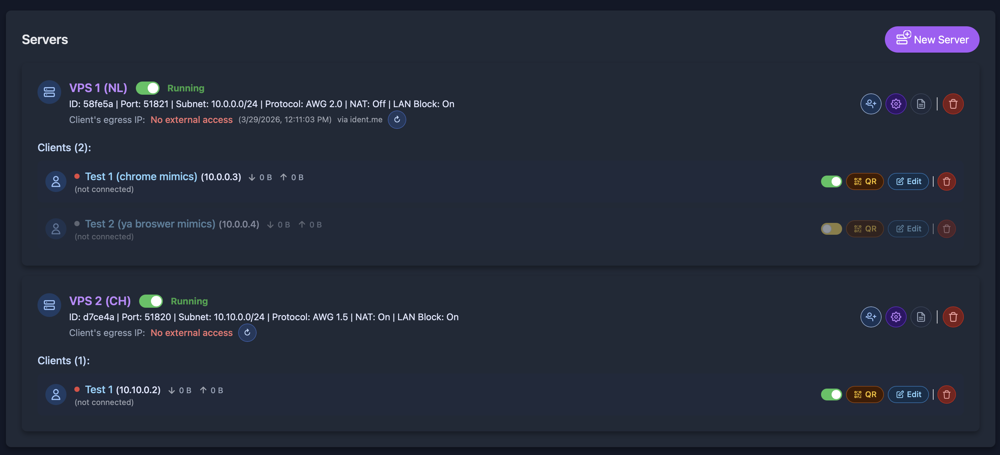

# AmneziaWG Web UI

A web UI for running [AmneziaWG](https://github.com/amnezia-vpn/amneziawg-go) VPN
servers — WireGuard with obfuscation that resists DPI-based blocking. Create servers,
manage clients, hand out configs, and watch traffic live, all from one container.

Almost everything is configurable in the UI. A handful of settings are startup-only
environment variables: `NGINX_PORT`, `NGINX_USER`/`NGINX_PASSWORD`, `API_TOKEN`,
`ENABLE_GEOIP`, `WAN_IF`, `ALLOWED_ORIGINS`, `LOG_LEVEL` (`ENABLE_NAT` and
`BLOCK_LAN_CIDRS` are only *defaults* — override them per server in the UI).

Current version: **2.1**

> Working on the code? See [DEVELOPMENT.md](DEVELOPMENT.md) for architecture, the
> state model, protocol/parameter details, conventions and open items.



## 🚀 Features

- **Servers and clients from the browser** — create, start/stop, rename, delete; add
  clients and hand out configs as `.conf`, text or QR code.
- **AWG 1.5 / 2.0 / 3.0 / 3.1**, with only the relevant fields shown per protocol.
  AWG 3.0 adds header protection, content padding and tunable timings; 3.1 adds
  random packet trailers and optional cookie-reply suppression.
- **Live monitoring** — per-client traffic, endpoint and handshake age over WebSocket,
  with country flags for endpoint / server / egress IPs.
- **Client suspend** — revoke access without deleting; keys are preserved.
- **Automatic networking** — iptables NAT and optional private-LAN blocking per
  server, auto-start on container restart, smart port/subnet/IP proposals.
- **Dark theme**, collapsible help, inline rename.
- Behind nginx HTTP Basic Auth, with an optional `API_TOKEN` for scripted access.

## 📝 Logging

There are two independent log streams, each with its own variable.

**VPN daemon (`amneziawg-go`)** — produced by the daemon itself, off by default. The container wraps it safely:

- `AWG_LOG_LEVEL`: `debug|verbose|error|silent` to enable logs (empty/`off` disables). Sets the daemon's own `LOG_LEVEL` internally.
- `AWG_LOG_FILE`: log file path (default: `/var/log/amnezia/amneziawg-go.log`).

Once enabled, use **Server → View Logs** in the UI. The log view filters by the selected server interface and shows related “startup banner” lines for that interface.

**Web UI** — always on, written to `/var/log/webui/access.log` with timestamps, levels and module names:

- `LOG_LEVEL`: `DEBUG|INFO|WARNING|ERROR` (default `INFO`). Use `DEBUG` when troubleshooting; anything unrecognised falls back to `INFO`.

```
2026-08-07 17:49:02 INFO    [services.amnezia_manager] Server myvpn started successfully
```

## 🏗️ Architecture

One container, three processes under supervisord: **nginx** (port 80, Basic Auth,
reverse proxy), the **Flask + Socket.IO web UI** (127.0.0.1:5000), and one
**`amneziawg-go`** daemon per VPN interface.

```
web-ui/
├── app.py                      Flask entrypoint, env parsing, auth decorator
├── core/                       runtime wiring, helpers, logging setup
├── routes/                     servers.py + system.py (all /api routes)
├── services/amnezia_manager.py all business logic
├── templates/index.html        page shell + create-server form
└── static/
    ├── css/style.css           incl. dark-theme overrides
    └── js/  app.js             state, sockets, API calls, validation
              modals.js         all dialogs
              server-ui.js      server/client card rendering
              protocols.js      the protocol table
              api.js            fetch/token plumbing
```

State lives in `/etc/amnezia/web_config.json` — the source of truth. WireGuard
`.conf` files under `/etc/amnezia/amneziawg/` are generated from it and never parsed
back. See [DEVELOPMENT.md](DEVELOPMENT.md) for the details.

## 🧩 I1–I5 (Custom Signature Packets)

`I1`–`I5` are custom signature packets sent prior to every handshake. They do not carry actual data, so they only need to be configured on the client side.

- `I1` is the primary packet (if `I1` is empty, the entire I1–I5 chain is skipped).
- `I2`–`I5` are optional follow-up packets (sent in order; empty values are skipped).

Official reference: https://github.com/amnezia-vpn/amneziawg-go#custom-signature-packets

This Web UI treats I1–I5 as **client-only** parameters:

- Server has **default** I1–I5 values (used only when creating *new* clients).
- Each client can override I1–I5 independently (different clients on the same server may have different values).
- Existing clients are **not** modified when server defaults change.
- If an I value is empty, the corresponding `I* = ...` line is **omitted** from generated client configs.

### Tag syntax (quick summary)

I-values are strings composed of tags:

- `<b 0x[hex]>` — static bytes (hex-encoded, e.g. `<b 0xf6ab3267fa>`)
- `<r [size]>` — random bytes (cryptographically secure)
- `<rd [size]>` — random digits (`0-9`)
- `<rc [size]>` — random chars (`a-zA-Z`)
- `<t>` — unix timestamp (4 bytes)

Example: `I1 = <b 0xf6ab3267fa><t><r 10>`

> **Note**: if the final size of any custom signature packet exceeds the system MTU, it may be fragmented, which can look suspicious to DPI.

In the UI:

- **Server → Show Config**: edit I1–I5 defaults for new clients.
- **Client row → I1–I5**: edit I1–I5 for that specific client.

## 📷 QR code notes

WireGuard configs can become too large to fit into a single QR code (especially with long I1–I5 values). When this happens, the UI will show an error in the QR modal and you should use **Download Config File (.conf)** instead.

## 🔧 API Endpoints

All `/api/*` routes sit behind nginx HTTP Basic Auth (`NGINX_USER` / `NGINX_PASSWORD`).
If `API_TOKEN` is set, they additionally require an `X-API-Token` header — useful for
scripts; redundant in a browser, where Basic Auth already gates everything.

Live updates over Socket.IO (`/socket.io/`) are the one exception: nginx does not
Basic-Auth-gate that path, because some browsers (notably iPadOS Safari) don't
reliably reattach cached Basic Auth credentials to a WebSocket handshake, which
showed up as endless credential prompts. Instead, Flask sets a persisted session
cookie on any request that already cleared Basic Auth on `/` or `/api/`, and the
WebSocket handshake is authorized from that cookie.

**Mutating requests must send `Content-Type: application/json`** (anything else gets
`415`). This is what stops another site's page from driving the API using your cached
Basic Auth credentials.

| Method | Path | Purpose |
|---|---|---|
| GET | `/api/servers` | list servers with live status and clients |
| POST | `/api/servers` | create (`name` required; `protocol`, `port`, `subnet`, `mtu`, `dns`, `auto_start`, `enable_nat`, `block_lan_cidrs`, `transport_params`, `client_defaults`) |
| DELETE | `/api/servers/<id>` | delete server and its clients |
| POST | `/api/servers/<id>/start` \| `/stop` | bring the interface up/down |
| GET | `/api/servers/<id>/info` | summary (status, keys, params, client count) |
| GET | `/api/servers/<id>/config` \| `/config/download` | the generated `.conf` |
| POST | `/api/servers/<id>/transport-params` | protocol + S1–S4 / H1–H4 / `HeaderProtectionKey` / AWG 3.1 toggles; restarts if running |
| POST | `/api/servers/<id>/networking` | NAT / LAN-block toggles; reapplies iptables |
| POST | `/api/servers/<id>/rename` | `{"name": "..."}` |
| GET | `/api/servers/<id>/traffic` | per-client rx/tx, endpoint, handshake age |
| POST | `/api/servers/<id>/egress-ip` | probe the server's outbound IP |
| GET | `/api/servers/<id>/clients` | list clients |
| POST | `/api/servers/<id>/clients` | add (`name`, optional `client_params`, `copy_from_client_id`) |
| DELETE | `/api/servers/<id>/clients/<cid>` | delete client |
| GET | `/api/servers/<id>/clients/<cid>/config` | download client `.conf` |
| GET | `/api/servers/<id>/clients/<cid>/config-both` | JSON: clean + commented, for QR |
| POST | `/api/servers/<id>/clients/<cid>/client-params` | update Jc/Jmin/Jmax, I1–I5, AWG 3.x timings |
| POST | `/api/servers/<id>/clients/<cid>/rename` \| `/suspend` | rename, or toggle access |
| GET | `/api/clients` | all clients across all servers |
| GET | `/api/system/status` | health, counts, public IP, supported protocols |
| GET | `/api/system/awg-log` | tail the daemon log (`?interface=&lines=`) |
| GET | `/api/system/refresh-ip` | re-detect the public IP |
| GET | `/api/system/iptables-test` | diagnostic (`?server_id=`) |
| GET | `/status` | container uptime, plain text (localhost only) |

Example:

```bash
curl -u admin:pass -H 'Content-Type: application/json' \
  -d '{"name":"My VPN","protocol":"AWG 3.0","subnet":"10.10.0.0/24","port":51820}' \
  http://localhost:8080/api/servers
```

Server-side params (S1–S4, H1–H4, `HeaderProtectionKey`, `RandomTrailers`,
`DisableCookies`) are written to both the server config and every client config, so
changing them means clients must re-import.
Client-side params (Jc, Jmin, Jmax, I1–I5, `ContentPaddingAddition`, timings) are
per-client and only appear in client configs.

## 🐳 Docker Deployment

Official docker image repository: https://hub.docker.com/r/stalker1211/amneziawg15-web-ui

### Environment Variables

| Variable | Default | Description |
|----------|---------|-------------|
| `NGINX_PORT` | `80` | External port for web interface |
| `NGINX_USER` | `admin` | Username for basic auth in the app |
| `NGINX_PASSWORD` | `changeme` | Password for basic auth in the app |
| `AUTO_START_SERVERS` | `true` | Auto-start servers on container startup |
| `DEFAULT_MTU` | `1280` | Default MTU value for new servers. Effective only for api requests. For UI management set via UI. |
| `DEFAULT_SUBNET` | `10.0.0.0/24` | Default subnet for new servers. Effective only for api requests. For UI management set via UI. |
| `DEFAULT_PORT` | `51820` | Default port for new servers. Effective only for api requests. For UI management set via UI. |
| `DEFAULT_DNS` | `8.8.8.8,1.1.1.1` | Default DNS servers for clients. Effective only for api requests. For UI management set via UI. |
| `ENABLE_NAT` | `1` | Default NAT/MASQUERADE setting for new servers (set `0` to disable). Per-server override is available in the UI. |
| `WAN_IF` | *(auto)* | Outbound/WAN interface used for NAT and forwarding rules. Auto-detected from the default route if unset (set explicitly if detection fails). |
| `BLOCK_LAN_CIDRS` | `1` | Default LAN-blocking for new servers. Blocks private LAN ranges (192.168.0.0/16, 10.0.0.0/8, 172.16.0.0/12). Set `0` to allow LAN access. Per-server override is available in the UI. |
| `ENABLE_GEOIP` | `1` | Enable GeoIP lookups for client endpoint IPs plus server public/egress IPs (adds country flag + location). Set `0` to disable external requests. |
| `API_TOKEN` | *(empty)* | Optional API token for `/api/*` endpoints (defense-in-depth). If set, all API requests must include either `X-API-Token: <token>` (recommended when using Nginx Basic Auth) or `Authorization: Bearer <token>`. Generate with: `openssl rand -hex 32` |
| `ALLOWED_ORIGINS` | *(empty)* | Socket.IO CORS allowed origins. Empty = same-origin only (recommended). Use `*` for development/all origins, or comma-separated list: `http://localhost:3000,https://vpn.example.com` |

## 🧪 Local build/run (dev)

This repo includes a convenience script that builds and runs a local container:

- `./run.sh` (idempotent; replaces existing container; builds image by default)
- Common overrides:
  - `BUILD=0 ./run.sh` (skip build)
  - `INTERACTIVE=1 ./run.sh` (run interactively)
  - `ENTRYPOINT=/bin/sh INTERACTIVE=1 ./run.sh` (debug shell)

### Docker Compose Example

```yaml
version: '3.8'
services:
  amnezia-web-ui:
    image: stalker1211/amneziawg15-web-ui:latest
    container_name: amnezia-web-ui
    ports:
      - "8080:8080/tcp"
      - "51820:51820/udp"
    environment:
      - NGINX_PORT=8080
      - AUTO_START_SERVERS=true
      - DEFAULT_MTU=1280
    volumes:
      - amnezia-data:/etc/amnezia
    cap_add:
      - NET_ADMIN
      - SYS_MODULE
    devices:
      - /dev/net/tun
    sysctls:
      - net.ipv4.ip_forward=1
      - net.ipv4.conf.all.src_valid_mark=1
    restart: unless-stopped
volumes:
 amnezia-data:
```

### Docker Run Example

```bash
docker run -d \
  --name amnezia-web-ui \
  --cap-add=NET_ADMIN \
  --cap-add=SYS_MODULE \
  --sysctl net.ipv4.ip_forward=1 \
  --sysctl net.ipv4.conf.all.src_valid_mark=1 \
  --device /dev/net/tun \
  --restart unless-stopped \
  -p 9090:9090 \
  -p 51821:51821/udp \
  -e NGINX_PORT=9090 \
  -e NGINX_PASSWORD=1234 \
  -e AUTO_START_SERVERS=false \
  -e DEFAULT_MTU=1420 \
  -e DEFAULT_SUBNET=10.8.0.0/24 \
  -e DEFAULT_PORT=51821 \
  -e DEFAULT_DNS="8.8.8.8,8.8.4.4" \
  -v amnezia-data:/etc/amnezia \
  stalker1211/amneziawg15-web-ui:latest
```

## 📊 Obfuscation Parameters

Two kinds, and the distinction matters:

- **Server-side** — must be identical on both ends. Written into the server config
  *and* every client config, so changing one means clients must re-import.
- **Client-side** — may differ per client; only appear in client configs.

| Parameter | Side | Protocol | Notes |
| --- | --- | --- | --- |
| `Jc` | client | 1.5+ | Junk packets sent before each handshake (4–12 typical) |
| `Jmin` / `Jmax` | client | 1.5+ | Junk packet size range; `Jmin` ≤ `Jmax`, keep `Jmax` < MTU or packets fragment |
| `I1`–`I5` | client | 1.5+ | Custom signature packets (tag syntax above). Empty values are omitted |
| `S1` | server | 1.5+ | Padding of the handshake initiation message. `S1 + 56 ≠ S2` |
| `S2` | server | 1.5+ | Padding of the handshake response message |
| `S3` / `S4` | server | 2.0+ | Padding of the cookie / transport messages |
| `H1`–`H4` | server | 1.5+ | Message header values. 2.0+ also accepts a range (`1200-1400`); ranges must not overlap |
| `HeaderProtectionKey` | server | 3.0+ | Encrypts packet headers. Requires each of S1–S4 ≥ 12 |
| `ContentPaddingAddition` | client | 3.0+ | Extra random bytes per data packet (`10-40`) |
| `RekeyAfterTime`, `RekeyTimeout`, `RejectAfterTime`, `KeepaliveTimeout`, `MaxHandshakeAttempts` | client | 3.0+ | Override WireGuard's fixed timings; ranges allowed. Empty = protocol default |
| `RandomTrailers` | server | **3.1** | Appends a random number of bytes to packets; mirrored to both ends |
| `DisableCookies` | server | **3.1** | Suppresses handshake cookie replies. Off by default because cookies mitigate handshake floods |
| `MTU` | — | all | Interface MTU (1280–1440) |

Junk packets and signature packets camouflage the *handshake* only; S/H values and
header protection affect the tunnel itself. The UI shows only the fields the selected
protocol supports, validates the constraints above before saving, and can generate a
random valid set for you.

## 🔍 Logs, backup and debugging

```bash
# Web UI (timestamps, levels, module names) — note: webui, not web-ui
docker exec amnezia-web-ui tail -f /var/log/webui/access.log
docker exec amnezia-web-ui tail -f /var/log/webui/error.log

# nginx / supervisor
docker exec amnezia-web-ui tail -f /var/log/nginx/error.log
docker exec amnezia-web-ui tail -f /var/log/supervisor/supervisord.log

# Backup: config plus every generated .conf
docker cp amnezia-web-ui:/etc/amnezia ./amnezia-backup/

# Live VPN state, straight from the daemon
docker exec amnezia-web-ui awg show
docker exec amnezia-web-ui awg showconf wg-<server-id>

# Health and firewall checks
curl -u admin:pass http://localhost:8080/api/system/status
curl -u admin:pass "http://localhost:8080/api/system/iptables-test?server_id=<server-id>"
```

Server ids are 6 characters (e.g. `a1b2c3`); the interface is `wg-<id>`. Restore by
putting `/etc/amnezia` back and restarting the container — servers with
`auto_start` come back up on their own.

# Security
The app is exposed directly on 80 or custom port with basic authentication.

> [!IMPORTANT]
> I strongly recommend protecting endpoints with firewall and/or nginx authentication.
> Basic auth alone is not strong enough and can be bruteforced.

By default, docker image is built with user `admin` and password `changeme`. To change the default behavior you need to provide with docker envs `NGINX_USER` and `NGINX_PASSWORD`.

> [!NOTE]
> There is no possibility to protect the built-in nginx with allow ip rule, because when run in docker with bridge mode docker doesn't pass the real client ip into the container. External proxy or additional container is required to perform client ip check.

# Support
The NO support provided as well as no regular updates are planned. Found issues can be fixed if free time permits.
