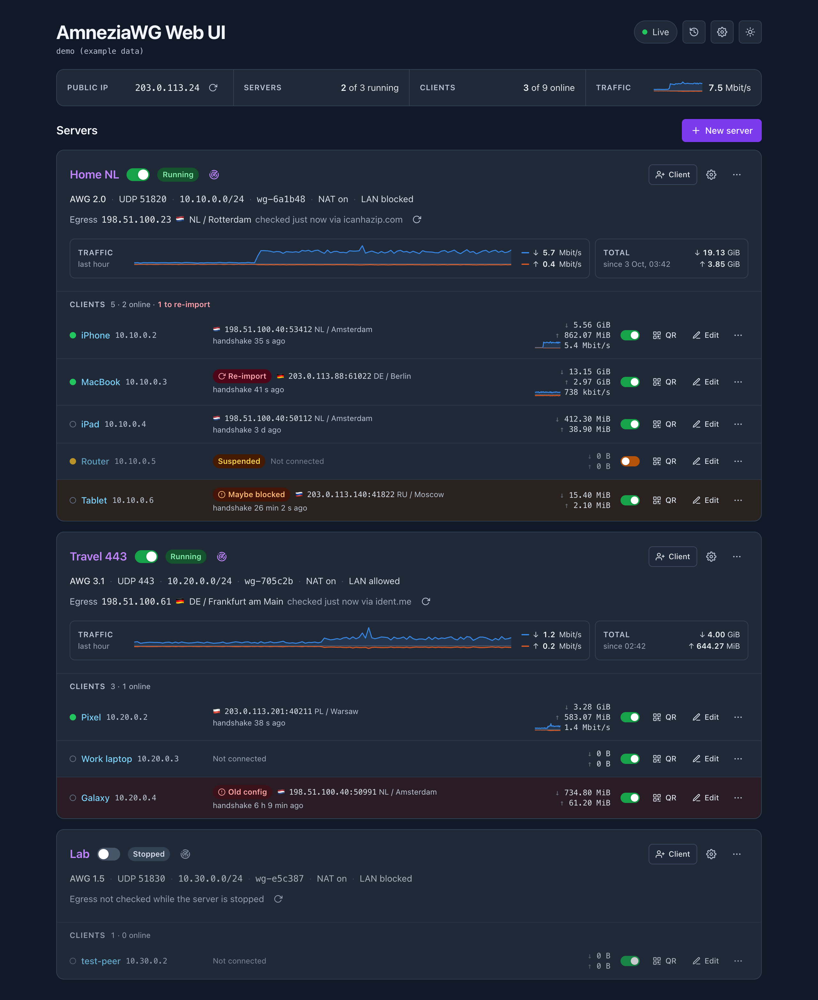

# AmneziaWG Web UI

A web UI for running [AmneziaWG](https://github.com/amnezia-vpn/amneziawg-go) VPN
servers — WireGuard with obfuscation that resists DPI-based blocking. Create servers,
manage clients, hand out configs, and watch traffic live, all from one container.

Everything is configurable in the panel, including its own settings (⚙ in the
header: sign-in, logging, GeoIP, new-server defaults). An environment variable can
pin a setting; only `NGINX_PORT`, `ALLOWED_ORIGINS`, `WAN_IF` and `AWG_LOG_FILE` are
deployment-only. See [Environment variables](#environment-variables).

Current version: **2.4**

> Working on the code? See [DEVELOPMENT.md](DEVELOPMENT.md) for architecture, the
> state model, protocol/parameter details, conventions and open items.



## 🚀 Features

- **Servers and clients from the browser** — create, start/stop, rename, delete; add
  clients and hand out configs as `.conf`, text or QR code.
- **AWG 1.5 / 2.0 / 3.0 / 3.1**, with only the relevant fields shown per protocol.
  AWG 3.0 adds header protection, content padding and tunable timings; 3.1 adds
  random packet trailers and optional cookie-reply suppression.
- **Live monitoring** — per-client traffic, endpoint and handshake age over WebSocket,
  with country flags for endpoint / server / egress IPs.
- **Re-import marks** — the panel remembers which config each device received and
  marks a client **Re-import** when its config has changed since (new transport
  parameters, new client parameters, a new public IP). Server settings say how many
  devices a change affects before you save.
- **Client suspend** — revoke access without deleting; keys are preserved.
- **Automatic networking** — iptables NAT and optional private-LAN blocking per
  server; a container restart brings back exactly the servers that were running;
  smart port/subnet/IP proposals.
- **Panel settings** (⚙) — the sign-in credential, the daemon's and the panel's log
  levels, GeoIP, and the defaults for new servers, stored with the servers.
- **Forms checked as you type** by the server, in a side drawer; toasts and in-app
  confirmations instead of browser pop-ups; works down to phone width.
- **Dark theme** (the OS preference picks the first one), collapsible help, inline rename.
- **Self-contained UI** — no CDN: the page loads nothing from other hosts, so it works
  without internet access and never tells a third party where your panel is.
- Behind nginx HTTP Basic Auth; the web UI itself listens on loopback only, and the
  page runs no inline script (CSP `script-src 'self'`).

## 📝 Logging

There are two independent log streams, each set in **⚙ → Logging** (or pinned by its
variable).

**VPN daemon (`amneziawg-go`)** — `off`, `error` (the default: silent unless something
fails) or `debug`, which adds every handshake and "Received message with unknown
type": the only trace of a client with outdated parameters, or of a scanner. The
daemon reads its level when a server starts, so the drawer offers to restart the
running servers. Variable: `AWG_LOG_LEVEL` (`verbose` means `debug`, `silent` means
`off`); it reaches the daemon only, never the panel's own level. The file is
`AWG_LOG_FILE` (default `/var/log/amnezia/amneziawg-go.log`).

Use **⋯ → Logs** on a server card. The log view filters by the selected server interface and shows related “startup banner” lines for that interface.

**Web UI** — always on, written to `/var/log/webui/access.log` with timestamps,
levels and module names. `ERROR`/`WARNING`/`INFO` (default)/`DEBUG`, applied at once.
Variable: `LOG_LEVEL`.

```
2026-08-07 17:49:02 INFO    [services.amnezia_manager] Server myvpn started successfully
```

## 🏗️ Architecture

One container, three processes under supervisord: **nginx** (port 80, Basic Auth,
reverse proxy), the **Flask + Socket.IO web UI** (127.0.0.1:5000), and one
**`amneziawg-go`** daemon per VPN interface.

```
web-ui/
├── app.py                      Flask entrypoint, env parsing
├── core/                       request guards (auth, CSRF), runtime wiring, helpers, logging
├── routes/                     servers.py + system.py (all /api routes)
├── services/amnezia_manager.py all business logic
├── templates/index.html        page shell
└── static/
    ├── css/style.css           a few styles (tailwind.css is built by build_css.sh)
    ├── vendor/                 socket.io + qrcode, unmodified release files
    └── js/  app.js             state, sockets, API calls, page actions
              forms.js          the forms (side drawer), checked by /api/validate
              modals.js         the QR, logs and full-config views
              ui.js             toasts, dialogs, drawer, menus, inline rename
              server-ui.js      server card and client row rendering
              protocols.js      reads the page config (protocol table, defaults)
              api.js            fetch plumbing
```

State lives in `/etc/amnezia/web_config.json` — the source of truth. WireGuard
`.conf` files under `/etc/amnezia/amneziawg/` are generated from it and never parsed
back. See [DEVELOPMENT.md](DEVELOPMENT.md) for the details.

## 🧩 I1–I5 (Custom Signature Packets)

`I1`–`I5` are custom signature packets sent prior to every handshake. They do not carry actual data, so they only need to be configured on the client side.

- `I1` is the primary packet (if `I1` is empty, the entire I1–I5 chain is skipped).
- `I2`–`I5` are optional follow-up packets (sent in order; empty values are skipped).

Official reference: https://github.com/amnezia-vpn/amneziawg-go#custom-signature-packets

This Web UI treats I1–I5 as **client-only** parameters:

- Server has **default** I1–I5 values (used only when creating *new* clients).
- Each client can override I1–I5 independently (different clients on the same server may have different values).
- Existing clients are **not** modified when server defaults change.
- If an I value is empty, the corresponding `I* = ...` line is **omitted** from generated client configs.

### Tag syntax (quick summary)

I-values are strings composed of tags:

- `<b 0x[hex]>` — static bytes (hex-encoded, e.g. `<b 0xf6ab3267fa>`)
- `<r [size]>` — random bytes (cryptographically secure)
- `<rd [size]>` — random digits (`0-9`)
- `<rc [size]>` — random chars (`a-zA-Z`)
- `<t>` — unix timestamp (4 bytes)

Example: `I1 = <b 0xf6ab3267fa><t><r 10>`

> **Note**: if the final size of any custom signature packet exceeds the system MTU, it may be fragmented, which can look suspicious to DPI.

In the UI:

- **+ Client**: set I1–I5 for a new client, starting from the server's defaults or
  copying another client.
- **Client row → Edit**: change I1–I5 for that client.

## 📷 QR code notes

WireGuard configs can become too large to fit into a single QR code (especially with long I1–I5 values). When this happens, the QR view shows an error and you should use **Download .conf** instead. The QR carries the config without comments, which keeps it as small as possible.

## 🔧 API Endpoints

All `/api/*` routes sit behind nginx HTTP Basic Auth (`NGINX_USER` / `NGINX_PASSWORD`),
the only credential: the web UI listens on 127.0.0.1 inside the container, so nothing
reaches it around nginx. Scripts send the same Basic Auth (`curl -u`). `API_TOKEN` was
removed in 2.4; a container that still sets it logs a warning and ignores it.

Live updates over Socket.IO (`/socket.io/`) are the one exception: nginx does not
Basic-Auth-gate that path, because some browsers (notably iPadOS Safari) don't
reliably reattach cached Basic Auth credentials to a WebSocket handshake, which
showed up as endless credential prompts. Instead, Flask sets a persisted session
cookie on any request that already cleared Basic Auth on `/` or `/api/`, and the
WebSocket handshake is authorized from that cookie.

**Mutating requests must send `Content-Type: application/json`** (anything else gets
`415`). This is what stops another site's page from driving the API using your cached
Basic Auth credentials.

| Method | Path | Purpose |
|---|---|---|
| GET | `/api/servers` | everything the page shows: servers with live status, their clients and each client's traffic (bytes, endpoint, handshake age) |
| POST | `/api/servers` | create (`name` required; `protocol`, `port`, `subnet`, `mtu`, `dns`, `auto_start`, `enable_nat`, `block_lan_cidrs`, `transport_params`, `client_defaults`) |
| DELETE | `/api/servers/<id>` | delete server and its clients |
| POST | `/api/servers/<id>/start` \| `/stop` | bring the interface up/down |
| GET | `/api/servers/<id>/info` | summary (status, keys, params, client count) |
| GET | `/api/servers/<id>/config` \| `/config/download` | the generated `.conf` |
| POST | `/api/servers/<id>/transport-params` | protocol + S1–S4 / H1–H4 / `HeaderProtectionKey` / AWG 3.1 toggles; restarts if running |
| POST | `/api/servers/<id>/networking` | NAT / LAN-block toggles; reapplies iptables |
| POST | `/api/servers/<id>/rename` | `{"name": "..."}` |
| POST | `/api/servers/<id>/egress-ip` | probe the server's outbound IP |
| POST | `/api/servers/<id>/clients` | add (`name`, optional `client_params`, `copy_from_client_id`) |
| DELETE | `/api/servers/<id>/clients/<cid>` | delete client |
| GET | `/api/servers/<id>/clients/<cid>/config` | download client `.conf` |
| GET | `/api/servers/<id>/clients/<cid>/config-both` | JSON: clean + commented, for QR |
| POST | `/api/servers/<id>/clients/<cid>/client-params` | update Jc/Jmin/Jmax, I1–I5, AWG 3.x timings |
| POST | `/api/servers/<id>/clients/<cid>/rename` \| `/suspend` | rename, or toggle access |
| POST | `/api/servers/<id>/clients/<cid>/issued` | record that the current config was handed to the device (clears `config_outdated`) |
| GET | `/api/settings` | panel settings: values, where each comes from (`env`, `panel`, `default`), the sign-in's state, versions |
| POST | `/api/settings` | `{"settings": {...}, "access": {"current_password", "user", "password"}}`; nothing applies unless all of it is valid |
| POST | `/api/settings/restart-servers` | restart the running servers (a new daemon log level) |
| POST | `/api/generate` | random parameters for a protocol: `{"protocol", "mtu"}` → `{"transport_params", "client_defaults"}`; saves nothing |
| POST | `/api/validate` | dry-run a form: `{"server": {...}}`, `{"server_id", "protocol", "transport_params"}` or `{"server_id", "client_params"}` → `{"errors", "warnings"}` |
| GET | `/api/system/status` | health, counts, public IP, supported protocols |
| GET | `/api/system/awg-log` | tail the daemon log (`?interface=&lines=`) |
| POST | `/api/system/refresh-ip` | re-detect the public IP (`502`, nothing changed, when detection fails) |
| GET | `/api/system/iptables-test` | diagnostic (`?server_id=`) |
| GET | `/status` | container uptime, plain text (localhost only) |

Example:

```bash
curl -u admin:pass -H 'Content-Type: application/json' \
  -d '{"name":"My VPN","protocol":"AWG 3.0","subnet":"10.10.0.0/24","port":51820}' \
  http://localhost:8080/api/servers
```

Server-side params (S1–S4, H1–H4, `HeaderProtectionKey`, `RandomTrailers`,
`DisableCookies`) are written to both the server config and every client config, so
changing them means clients must re-import.
Client-side params (Jc, Jmin, Jmax, I1–I5, `ContentPaddingAddition`, timings) are
per-client and only appear in client configs.

## 🐳 Docker Deployment

Official docker image repository: https://hub.docker.com/r/stalker1211/amneziawg15-web-ui

### Environment variables

**Settings.** Each is also in the panel (⚙). While its variable is set (and not
empty) the value is copied into the stored settings at every boot and the field is
read-only; remove the variable and the last value stays, now editable. An invalid
value is logged and ignored. So upgrading changes nothing: the first 2.4 boot copies
today's environment.

| Variable | Default | Setting |
|----------|---------|---------|
| `NGINX_USER` / `NGINX_PASSWORD` | `admin` / `changeme` | The Basic Auth sign-in. Stored hashed in `/etc/amnezia/.htpasswd`; see [Security](#security) |
| `DEFAULT_MTU` | `1280` | MTU of new servers (1280–1440) |
| `DEFAULT_SUBNET` | `10.0.0.0/24` | Subnet of new servers |
| `DEFAULT_PORT` | `51820` | First UDP port offered for new servers |
| `DEFAULT_DNS` | `8.8.8.8, 1.1.1.1` | DNS servers of new servers, pushed to clients |
| `ENABLE_NAT` | `1` | NAT/MASQUERADE for new servers; each server has its own switch |
| `BLOCK_LAN_CIDRS` | `1` | Block private LAN ranges for new servers; each server has its own switch |
| `ENABLE_GEOIP` | `1` | Country and city of endpoint, public and egress IPs (asks ipapi.co) |
| `AWG_LOG_LEVEL` | `error` | The VPN daemon's log: `off`, `error`, `debug` |
| `LOG_LEVEL` | `INFO` | The web panel's log |

**Deployment.**

| Variable | Default | Description |
|----------|---------|-------------|
| `NGINX_PORT` | `80` | Port nginx listens on inside the container |
| `ALLOWED_ORIGINS` | *(empty)* | Socket.IO origins besides the panel's own. Needed behind a TLS reverse proxy: nginx passes on `X-Forwarded-Proto: http`, so the `https://` origin fails Socket.IO's same-origin check; set it to that origin, e.g. `https://vpn.example.com`. `*` allows any |
| `WAN_IF` | *(auto)* | Outbound interface for the NAT and forwarding rules; detected from the default route |
| `AWG_LOG_FILE` | `/var/log/amnezia/amneziawg-go.log` | Where the daemon's log goes |

Retired: `AUTO_START_SERVERS` (a restart brings back what was running; `false` still
means "start nothing at boot" for now), `API_TOKEN` (2.4; ignored with a warning).
`SYS_MODULE` is not needed: the daemon runs in userspace.

## 🧪 Local build/run (dev)

This repo includes a convenience script that builds and runs a local container:

- `./run.sh` (idempotent; replaces existing container; builds image by default)
- Common overrides:
  - `BUILD=0 ./run.sh` (skip build)
  - `INTERACTIVE=1 ./run.sh` (run interactively)
  - `ENTRYPOINT=/bin/sh INTERACTIVE=1 ./run.sh` (debug shell)

### Image tags

`stalker1211/amneziawg15-web-ui:latest` is the newest build; `:2.3` and so on pin a
release. The version under the page heading (e.g. `v2.3 build 20260928.1`) shows
exactly which one is running.

### Docker Compose Example

```yaml
version: '3.8'
services:
  amnezia-web-ui:
    image: stalker1211/amneziawg15-web-ui:latest
    container_name: amnezia-web-ui
    ports:
      - "8080:8080/tcp"
      - "51820:51820/udp"
    environment:
      - NGINX_PORT=8080
    volumes:
      - amnezia-data:/etc/amnezia
    cap_add:
      - NET_ADMIN
    devices:
      - /dev/net/tun
    sysctls:
      - net.ipv4.ip_forward=1
      - net.ipv4.conf.all.src_valid_mark=1
    restart: unless-stopped
volumes:
 amnezia-data:
```

### Docker Run Example

```bash
docker run -d \
  --name amnezia-web-ui \
  --cap-add=NET_ADMIN \
  --sysctl net.ipv4.ip_forward=1 \
  --sysctl net.ipv4.conf.all.src_valid_mark=1 \
  --device /dev/net/tun \
  --restart unless-stopped \
  -p 9090:9090 \
  -p 51821:51821/udp \
  -e NGINX_PORT=9090 \
  -v amnezia-data:/etc/amnezia \
  stalker1211/amneziawg15-web-ui:latest
```

## 📊 Obfuscation Parameters

Two kinds, and the distinction matters:

- **Server-side** — must be identical on both ends. Written into the server config
  *and* every client config, so changing one means clients must re-import.
- **Client-side** — may differ per client; only appear in client configs.

| Parameter | Side | Protocol | Notes |
| --- | --- | --- | --- |
| `Jc` | client | 1.5+ | Junk packets sent before each handshake (4–12 typical; 0 sends none) |
| `Jmin` / `Jmax` | client | 1.5+ | Junk packet size range; `Jmin` ≤ `Jmax`, keep `Jmax` < MTU or packets fragment |
| `I1`–`I5` | client | 1.5+ | Custom signature packets (tag syntax above). Empty values are omitted |
| `S1` | server | 1.5+ | Padding of the handshake initiation message. `S1 + 56 ≠ S2` |
| `S2` | server | 1.5+ | Padding of the handshake response message |
| `S3` / `S4` | server | 2.0+ | Padding of the cookie / transport messages |
| `H1`–`H4` | server | 1.5+ | Message header values. 2.0+ also accepts a range (`1200-1400`); ranges must not overlap |
| `HeaderProtectionKey` | server | 3.0+ | Encrypts packet headers. Requires each of S1–S4 ≥ 12 |
| `ContentPaddingAddition` | client | 3.0+ | Extra random bytes per data packet (`10-40`) |
| `RekeyAfterTime`, `RekeyTimeout`, `RejectAfterTime`, `KeepaliveTimeout`, `MaxHandshakeAttempts` | client | 3.0+ | Override WireGuard's fixed timings; ranges allowed. Empty = protocol default |
| `RandomTrailers` | server | **3.1** | Appends a random number of bytes to packets; mirrored to both ends |
| `DisableCookies` | server | **3.1** | Suppresses handshake cookie replies. Off by default because cookies mitigate handshake floods |
| `MTU` | — | all | Interface MTU (1280–1440) |

Junk packets and signature packets camouflage the *handshake* only; S/H values and
header protection affect the tunnel itself. The UI shows only the fields the selected
protocol supports and validates the constraints above as you type: I1–I5 tags as
the daemon parses them, uint16/uint32 bounds, and warnings for equal message sizes,
H values in WireGuard's own 1–4 (without header protection) and AWG 3.x timers that
fight each other.

Every new server gets its own random parameters, drawn by the server
(`/api/generate`, ported from [AmneziaWG Architect](https://github.com/Vadim-Khristenko/Any-Tech-ARCHITECT)):
four disjoint H ranges under 2³¹−1, S sizes that never make two message types the
same length, a small junk train (Jc 4–12, Jmax ≤ 160), and on AWG 3.x a header
protection key, content padding and timers that keep WireGuard's timer rules.
**Randomize** draws a fresh set.

## 🔍 Logs, backup and debugging

```bash
# Web UI (timestamps, levels, module names) — note: webui, not web-ui
docker exec amnezia-web-ui tail -f /var/log/webui/access.log
docker exec amnezia-web-ui tail -f /var/log/webui/error.log

# nginx / supervisor
docker exec amnezia-web-ui tail -f /var/log/nginx/error.log
docker exec amnezia-web-ui tail -f /var/log/supervisor/supervisord.log

# Backup: config plus every generated .conf
docker cp amnezia-web-ui:/etc/amnezia ./amnezia-backup/

# Live VPN state, straight from the daemon
docker exec amnezia-web-ui awg show
docker exec amnezia-web-ui awg showconf wg-<server-id>

# Health and firewall checks
curl -u admin:pass http://localhost:8080/api/system/status
curl -u admin:pass "http://localhost:8080/api/system/iptables-test?server_id=<server-id>"
```

Server ids are 6 characters (e.g. `a1b2c3`); the interface is `wg-<id>`. Restore by
putting `/etc/amnezia` back and restarting the container — the servers that were
running come back up on their own. The backup holds the settings and the hashed
sign-in (`.htpasswd`) too.

# Security
The app is exposed directly on 80 or custom port with basic authentication.

> [!IMPORTANT]
> I strongly recommend protecting endpoints with firewall and/or nginx authentication.
> Basic auth alone is not strong enough and can be bruteforced.

A new volume signs in with `admin` / `changeme`, and the panel shows a **Default
password** banner (and the log a warning) until it is changed. Change it in
**⚙ → Access** (the current password is required); it is stored hashed (SHA-512 crypt)
in `/etc/amnezia/.htpasswd`, so it survives image updates, and saving it signs every
browser out. Setting `NGINX_PASSWORD` instead pins it (the field turns read-only),
which also works as a recovery: set it, restart, sign in, remove it. Prefer the
drawer for a compose file kept in git.

> [!NOTE]
> There is no possibility to protect the built-in nginx with allow ip rule, because when run in docker with bridge mode docker doesn't pass the real client ip into the container. External proxy or additional container is required to perform client ip check.

# Support
The NO support provided as well as no regular updates are planned. Found issues can be fixed if free time permits.
